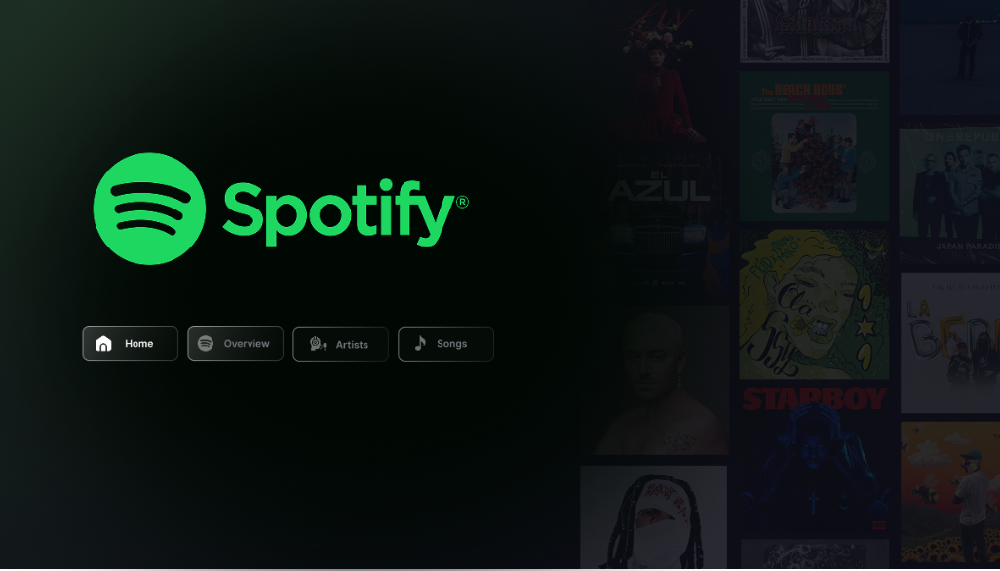
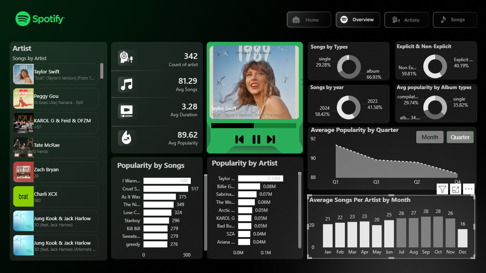
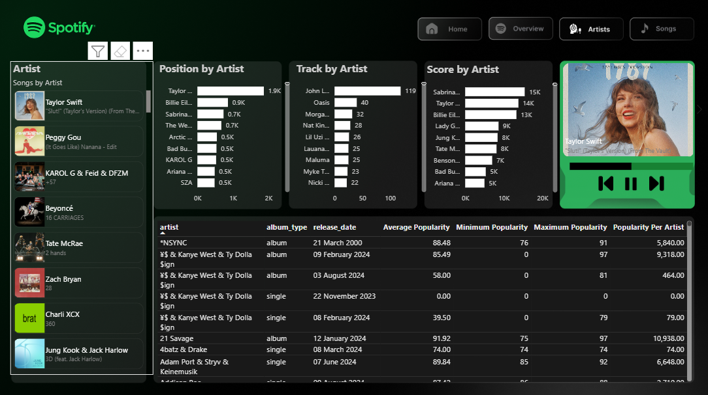
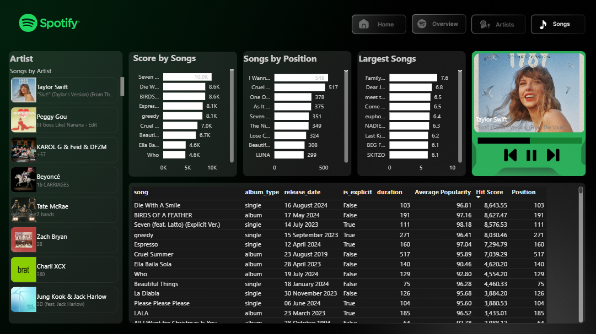

# 🎵 Spotify Analytics Dashboard


<p align="center">
  A modern <b>Power BI dashboard</b> for Spotify music analytics featuring artist insights, song performance, popularity metrics, album analysis, and listening trends.
</p>

---

## ✨ Project Overview

This project is an **interactive Spotify Analytics Dashboard** built using **Power BI** to analyze music streaming insights, artist performance, song popularity, album types, and trend patterns.

The dashboard provides a visually rich and interactive experience to explore:

- 🎤 Artist Analytics
- 🎵 Song Performance
- 📈 Popularity Trends
- 💿 Album Analysis
- 📊 Streaming Metrics
- 📅 Time-Based Insights

---

## 🖼️ Dashboard Preview

### 🏠 Home Page

<p align="center">
  
</p>

Minimal landing page for seamless dashboard navigation.

---

### 📊 Overview Dashboard

<p align="center">
  
</p>

#### Key Insights:
- Total Artists Count
- Average Song Duration
- Popularity Metrics
- Explicit vs Non-Explicit Songs
- Album Type Analysis
- Quarterly Popularity Trends

---

### 🎤 Artist Analysis

<p align="center">
  
</p>

#### Features:
- Artist Ranking
- Position by Artist
- Track Count Analysis
- Score by Artist
- Artist Popularity Comparison

---

### 🎵 Songs Analysis

<p align="center">
  
</p>

#### Features:
- Song Rankings
- Hit Score Analysis
- Song Popularity Metrics
- Song Position Analysis
- Album Type Breakdown

---

## 🚀 Key Features

✅ Interactive navigation buttons  
✅ Dynamic filtering & slicers  
✅ KPI cards for performance tracking  
✅ Artist-level drill-down analysis  
✅ Modern Spotify-inspired UI design  
✅ Dark aesthetic dashboard theme  
✅ Responsive visuals

---

## 🛠️ Tools & Technologies

| Tool | Purpose |
|------|----------|
| Power BI | Dashboard Development |
| Power Query | Data Cleaning & Transformation |
| DAX | KPI Calculations & Measures |
| CSV | Dataset Source |

---

## 📂 Repository Structure

```plaintext
spotify-powerbi-dashboard/
│── Spotify/
│   ├── home.png
│   ├── overview.png
│   ├── artist.png
│   └── songs.png
│
│── dataset/
│   └── spotify_dataset.csv
│
│── spotify_dashboard.pbix
│── README.md
```

---

## 📌 KPIs Used

- Total Artists
- Average Songs
- Average Duration
- Average Popularity
- Hit Score
- Song Ranking
- Album Type Distribution
- Explicit vs Non-Explicit Ratio

---

## 📈 Dashboard Insights

- **Taylor Swift** dominates artist popularity.
- **Albums** contribute higher engagement than singles.
- **2024 songs** show stronger popularity trends.
- **Explicit songs** account for a significant portion of engagement.
